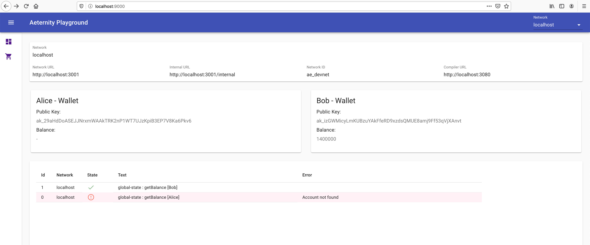
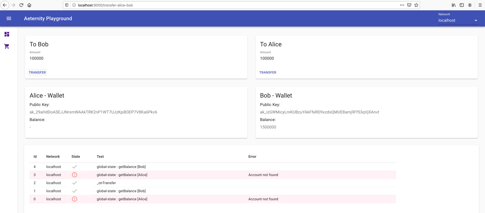

# aeternity-playground
[Aeternity](https://aeternity.com/) blockchain playground

## network
This works best with a local docker-based network, created with the aeproject tool.

- [aeproject - github](https://github.com/aeternity/aepp-aeproject-js)
- [aeproject - documentation](https://aeproject.gitbook.io/aeproject/)

It's possible to select the test network but the transfer functionality doesn't work there.

## client/ts

TypeScript/React client with rudimentary [aeapp-sdk-js](https://github.com/aeternity/aepp-sdk-js) TypeScript definitions.

### Functionality
- Select network
- Transfer funds between Alice and Bob

#### Dashboard

#### Transfer between Alice and Bob

