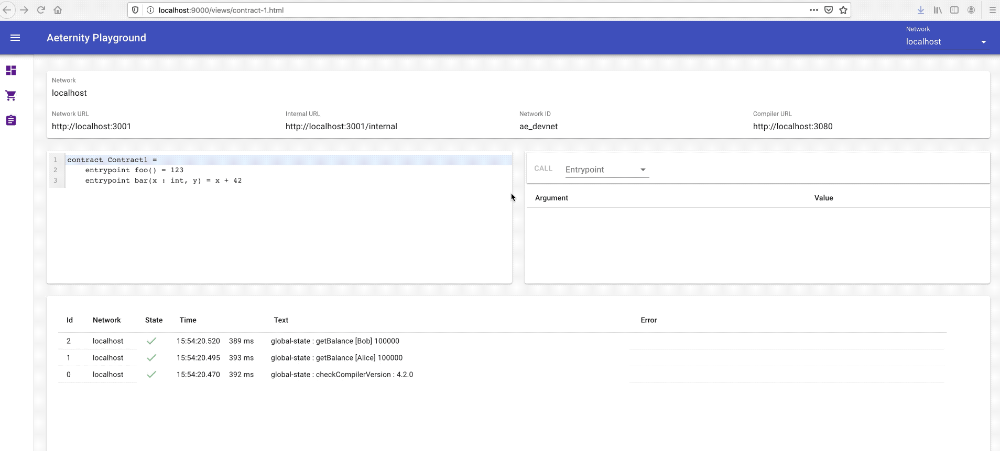

# aeternity-playground
[Aeternity](https://aeternity.com/) blockchain playground


## network
This works best with a local docker-based network, created with the aeproject tool.

- [aeproject - github](https://github.com/aeternity/aepp-aeproject-js)
- [aeproject - documentation](https://aeproject.gitbook.io/aeproject/)

It's possible to select the test network but the transfer-/contract-functionality doesn't work there.

## client/ts

TypeScript/React client with rudimentary [aeapp-sdk-js](https://github.com/aeternity/aepp-sdk-js) TypeScript definitions.

### Build

See [build-instructions](./client/ts/README.md).
### Functionality
- Select network
- Transfer funds between Alice and Bob
- Call contract

#### Dashboard
**Note:** If Alice or Bob wallets shows up as "Account not found" on localhost, just transfer funds between them to add the accounts.


#### Transfer between Alice and Bob


#### Call contract



**contract-1.aes**
```
contract Contract1 = 
    entrypoint foo() = 123
    entrypoint bar(x : int, y) = x + 42
```

**Example code**, load contract source, compile, deploy and call `bar(1, 23)`
```typescript
// client/ts/src/example-code.ts
export async function callContractEntryPoint1() {
    // Get the universal flavor
    const universal = await ae_utils.getCachedUniversal()

    // Load contract source
    const contractSrc = await utils.getContract('contract-1.aes')

    // Compile
    const compileResult = await universal.contractCompile(contractSrc)

    // Deploy
    const deployResult = await compileResult.deploy([])

    // Call entrypoint bar(1, 23)
    const callResult = await deployResult.call('bar', ['1', '23'])

    // Log result
    const r = callResult.result
    console.log('returnValue=' + r.returnValue)
    console.log('gasPrice=' + r.gasPrice)
    console.log('gasUsed=' + r.gasUsed)
    console.log('height=' + r.height)

    // Decode result value
    const decodedValue = await callResult.decode()
    console.log('decodedValue=' + decodedValue)
}
```

**Example output**
```text
returnValue=cb_Vl4/10M=
gasPrice=1000000000
gasUsed=22
height=15060
decodedValue=43
```


